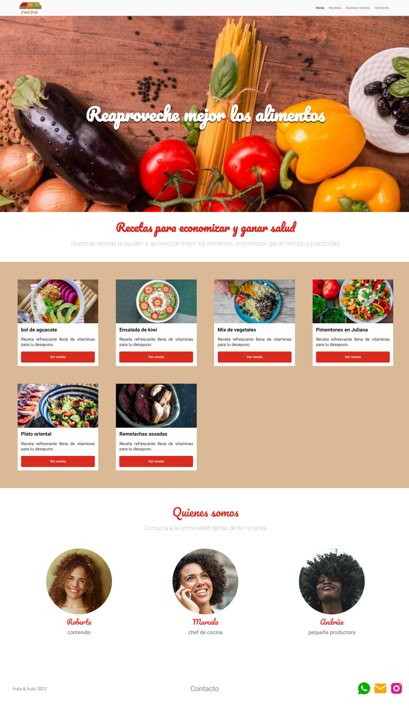

# Arquitectura CSS - Proyecto del curso

Proyecto del curso de Arquitectura CSS de **Alura LATAM**, este proyecto es la página web de un sitio de recetas que lleva por nombre Fruta & Fruto construido en el transcurso del curso. 

## Tecnologías utilizadas:
- HTML5
- CSS3

## Descripción del proyecto
El proyecto fue realizado aplicando la metodología **Atomic Design** creando un archivo para cada CSS, manteniendo así nuestros códigos cortos y facilitando el mantenimiento de la página web.

 

## Editor del proyecto

| [Emmanuel Van Dick] ("https://avatars.githubusercontent.com/u/93367648?v=4") |
| :---: |
